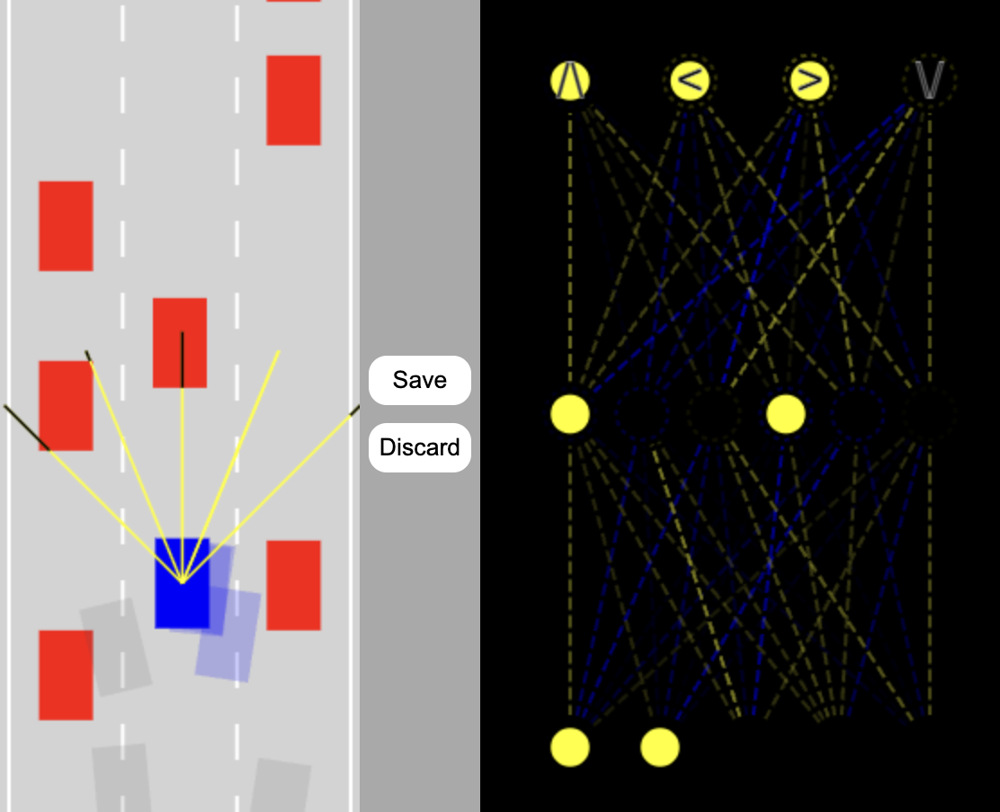

# Self-Driving Car (No Libraries)

A browser-based simulation of a self-driving car built with *vanilla JavaScript*, HTML, and CSS. This project demonstrates core artificial intelligence concepts such as **neural networks, mutation, sensor simulation, and path-finding**—all without external libraries.

## 🚗 Features

- **AI-Powered Driving**: Simulates self-driving behavior using neural networks.
- **Mutation \& Evolution**: Evolve car behaviors through mutation and selection.
- **Interactive Visualization**: Real-time neural network and environment visualization.
- **Sensor Simulation**: Virtual sensors for detecting obstacles and road boundaries.
- **No Dependencies**: Runs fully in the browser, no external JS libraries required.




## 🖥️ Demo

Open `index.html` in your browser to start the simulation.

## 📦 Project Structure

```
.
├── index.html         # Main HTML file
├── style.css          # Stylesheet
├── car.js             # Car properties and controls
├── controls.js        # Keyboard/controller logic
├── road.js            # Road environment
├── sensor.js          # Car sensors
├── network.js         # Neural network implementation
├── visualizer.js      # Neural network visualizer
├── utils.js           # Utilities and helpers
├── main.js            # App entry point (simulation logic)
└── changingStuff.txt  # Hints on customizing visuals
```


## 🚀 Getting Started

1. **Clone or Download** this repo.
2. Open `index.html` in your browser—**that’s it!**
3. Save/discard neural network progress with the on-screen buttons.

## 🧠 How It Works

- AI-controlled cars attempt to navigate a simulated road.
- The *best-performing car's neural network* can be saved locally.
- Other cars mutate from the best solution, enabling evolutionary learning.
- Traffic cars act as dynamic obstacles.


## 📝 Customization

- Adjust the number of AI cars or mutation rate in `main.js`.
- Modify sensor settings in `sensor.js`.
- Change road/environment parameters in `road.js`.

